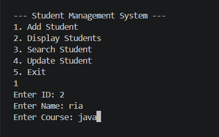
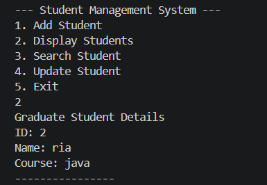
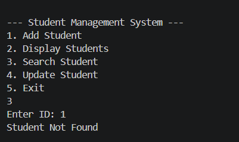

# Student Management System

## Overview
A console-based Student Management System developed using Java and Object-Oriented Programming concepts.

## Features
- Add Student
- Display Student Records
- Search Student
- Update Student Information

## Technologies Used
- Java
- OOP
- ArrayList

## OOP Concepts Used
- Encapsulation
- Inheritance
- Polymorphism

## Future Enhancements
- MySQL Integration using JDBC
- Delete Student Functionality
- GUI Development

## Author
Ponde Shirisha

## Screenshots

### Add Student

### Display Student

### Search Student

